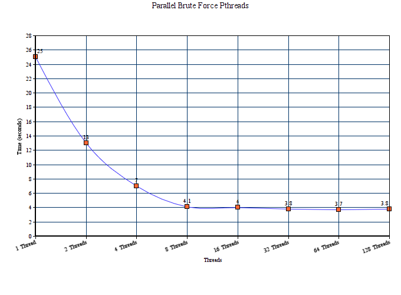

# Parallel brute force

## Pthreads

- Some variables to be fixed
- Works for now
- Speed-up good on local
- Results to be added after cluster testing

Update: All fixed!

## Speedups

- 1 th => ~25 secunde
- 2 th => ~13 secunde
- 4 th => ~7 secunde
- 8 th => ~4.1 secunde
- 16 th => ~4 secunde
- 32 th => ~3.8 secunde
- 64 th => ~3.7 secunde
- 128 th => ~3.8 secunde

Notă: Rulările făcute folosind dataset.txt.

## Vizualizare rezultate

