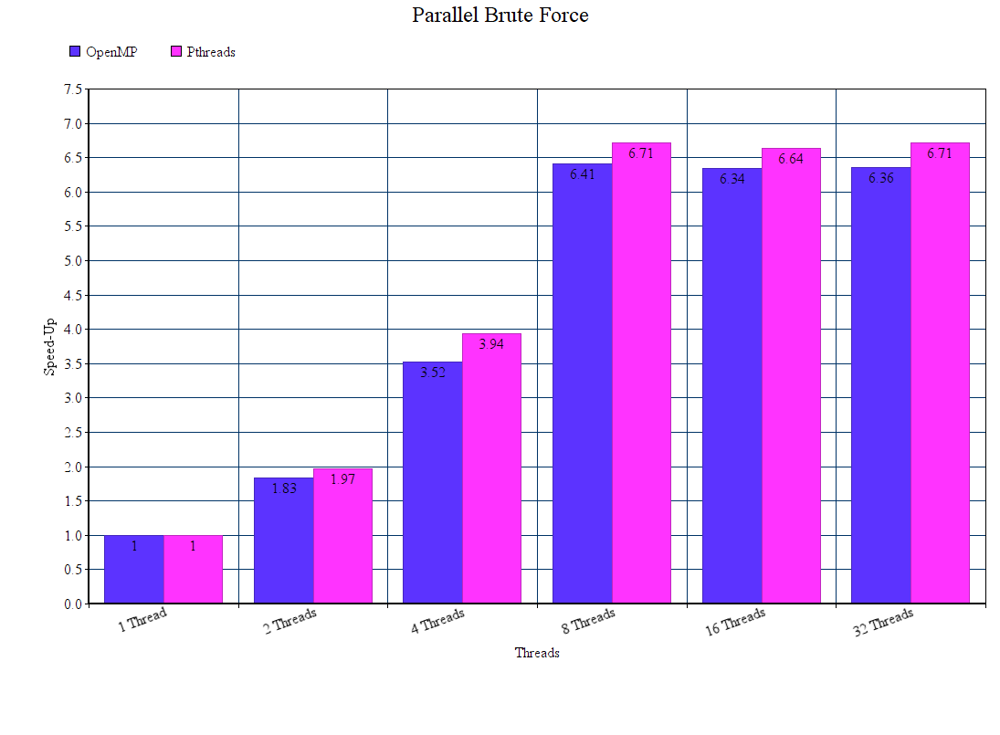

# Parallel brute force

## Scopul proiectului

Acest program este creat pentru a sparge șirurile dintr-un set de date în parole
care au fost criptate cu SHA-256. Codul tilizează o metodă de tip bruteforce
care testează toate rezultatele posibile pentru o parolă criptată SHA-256 de o
anumită lungime dată și o compară cu șirul care urmează să fie decriptat.

#### Ce este SHA-256?

SHA-256 este una dintre cele mai sigure funcții de hashing de pe piață. SHA-256
este utilizat în unele dintre cele mai populare protocoale de autentificare și
criptare, inclusiv SSL, TLS, IPsec, SSH și PGP. În Unix și Linux, SHA-256 este
folosit pentru hashing securizat al parolei. Criptomonede precum Bitcoin folosesc
SHA-256 pentru verificarea tranzacțiilor.

#### Ce face codul nostru?

Am pornit de la [acest cod](https://rosettacode.org/wiki/Parallel_brute_force#C)
care este făcut să funcționeze doar pe niște șiruri hard-coded de o lungime
statică și. Acum codul nostru poate identifica parole de orice lungime sub un
anumit număr dat. Deoarece abordarea de bruteforce SHA-256 crește exponențial
în timp cu cât parolele sunt mai lungi, am limitat codul nostru la o lungime a
parolelor inițiale de doar 5 caractele alfabetice, pentru ușurința testării și
demonstrării didactice.

În plus față de codul inițial de pe Rosetta Code, șirurile de decriptare sunt
acum păstrate într-un buffer care poate fi folosit pentru a citi 64 de octeți
ce reprezintă o parolă criptată de tip SHA-256 direct de la adresa dată a unui
descriptor de fișier (cum ar fi fișierul .txt pe care l-am folosit noi sau chiar
un socket TCP prin care se realizează o comunicație).

Un exemplu de timpi pe un singur thread necesari spargerii parolelor normale
prin brute-force poate fi vizualizat în imaginea de mai jos, luată de [aici](https://i.stack.imgur.com/lLoWD.png).
Rezultatele sunt orientative, importante sunt ordinele de mărime, nu valorile.

Având în vedere conversia cu SHA-256 și faptul că vrem să vedem exact cărui șir
citit îi corespunde care parolă decriptată, (implicit necesitatea folosirii
funcției SHA256 din libcrypto), timpul necesar programului nostru ar fi mult
mai mare (deși într-un ordin de mărime apropiat).

### TODOs #1 for Bruteforce SHA256

- Set de date ceva mai mare: 5-15s seriala
- Pregătire pentru profiling data viitoare
- Pagina + descriere proiect pe gitlab
- Profiling pe cluster + documentare pe gitlab
- Identificarea timpului / call-ului de libcrypto
- OpenMP / Pthreads

### Update TODO # 1

 - Creat fișier dataset.txt cu timp de rulare 20-25s pe versiunea locală
și 90-100s pe fep în varianta serială
 - Creat fișier dataset_short.txt care să poată rula pe fep în 15s
 - Profilare și documentare
 - Timpul de libcrypto identificat și analizat

## Rezultate pe cluster:

 - Varianta serială păstreză un procent de timp realtiv constant pentru
libcrypto.so (undeva peste 70%) la orice lungime a setului de date
 - Cu toate acestea folosirea ei este condiționată de apelarea în cadrul
for-urilor imbricate a funcției cu semnătura SHA256, ceea ce ar putea face
ca o rulare paralelă să merite, cel puțin din punctul de vedere al procesării
paralele a setului de date
 - Fiecare linie din fișier poate fi citită în paralel, iar fiecare parolă are
cel puțin primul for de selectare a literei de început a parolei de testat și
comparat care foarte fi paralelizat

## Profilare:

Așa cum am menționat mai devreme, se poate observa că media timpului petrecut
de către programul nostru în cadrul funcțiilor din libcrypto (mai exact în
cadrul funcției de conversie în SHA-256 -- funcție pe care o vom adăuga separat
drept resursă în această documentație) ocupă în jur de 3/4 proporții din total.

Vom reveni cu date de profilare după ce vom încerca să integrăm funcția complet
separată de bibliotecă. Nu știm încă dacă asta va afecta timpii de apelare.

Cu toate acestea, având în vedere acest call tree, putem spera că ruperea de
bibliotecă a funcției SHA-256 (care pare aici să ocupe timp doar în main), va
avea un impact cel puțin vizibil.

### TODOs #2

- Identificarea codului din call-ul de libcrypto (E un black-box momentan)
- OpenMP - Andrei - experimentare cu politici de scheduling diverse: static / dynamic /
guided cu chunksize-uri diverse
- Pthreads - Florin - thread I/O separat
- Teste scalabilitate: hp-sl.q: 1, 2, 5, 10, 20, 40 threaduri

### In Decembrie:

- Eventual o implementare recursiva cu taskuri după o implementare actuala.

### Update TODO # 2

- Am reușit să facem rost de cod-ul funcției SHA256 din libcrypto, care din
cât se pare NU este paralelizabil. Cu toate acestea, estimăm că împărțirea
setului de date pe thread-uri diferite și paralelizarea primului for din etapa
de bruteforce (pe un maxim de threaduri egal cu numărul de caractere din alfabet)
ar putea aduce îmbunătățiri de performanță. Vom reveni cu rezultate în acest sens
și cu testele de scalabilitate
- Mai mult, am încercat să integrăm direct funcțiile apelate din libcrypto în
codul nostru pentru a vedea dacă există vreun speed-up. Până acum nu am reușit,
deși estimarea este că nu se vor schimba multe. Vom reveni cu update-uri.
- *Am adăugat implementările pentru Pthreads și OpenMP.*
- Analiza pe hp-sl.q nu a fost realizată încă din cauza imposibilității de a 
instala sha.h pe coadă (lipsă de permisiuni), DAR am revenit cu update-uri de
rulare locală până la 128 de threaduri

### TODOs #3

- OpenMP - Andrei
- experimentare cu politici de scheduling diverse: static / dynamic / guided cu chunksize-uri diverse
- Pthreads - Florin - thread I/O separat - au folosit o biblioteca existenta
- Compilatoare gcc (gnu), icc (intel), cc (solaris) pe ibm-dp
- Deployment pe cluster si exportul include-path + lib-path + binary-path cum fac modulele de pe cluster
- Teste scalabilitate: hp-sl.q: 1, 2, 5, 10, 20, 40 threaduri + grafice + portare pe cluster pe alte cozi

## Rezultate

### Rezultate comparate pentru Pthreads și OpenMP

### Încărcarea medie a procesoarelor (locale, vom reveni cu rezultate pe fep)

### Speed-up (locale, vom reveni cu rezultate pe fep)

